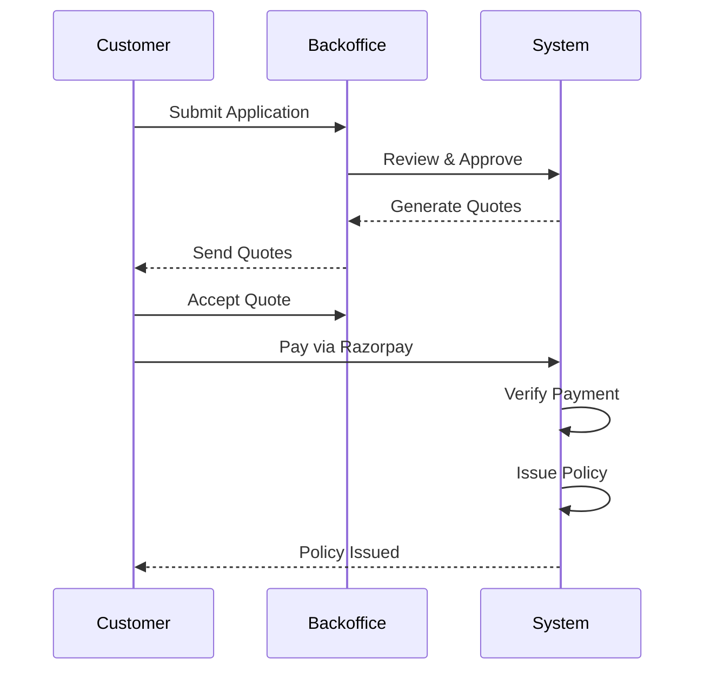
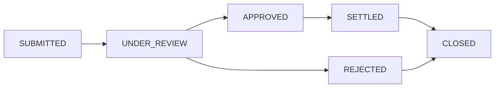

# Project Overview

## Intelligent Insurance Policy Management & Decision Support System

**Version:** 1.0  
**Date:** December 2025  
**Technology Stack:** Django 4.x + Django REST Framework + MySQL + JWT + Razorpay  

---

## 1. Executive Summary

This system is a comprehensive Insurance Policy Management & Decision Support Platform that enables end-to-end insurance operations from customer onboarding to claims settlement. It implements a **rule-based decision engine** for premium calculation and quote scoring, a **state machine workflow** for claims processing, and **role-based access control (RBAC)** for enterprise security.

### Key Highlights

| Feature | Implementation |
|---------|----------------|
| Authentication | JWT-based with session tracking |
| Authorization | Role-Based Access Control (Admin, Backoffice, Customer) |
| Payment Gateway | Razorpay Sandbox (real integration, HMAC-SHA256 signature verification) |
| Quote Engine | Rule-based scoring with weighted-factor algorithm |
| Claims Workflow | State machine with configurable approval thresholds |
| Configuration | Database-driven business rules (no hardcoding) |
| Admin Panel | Custom-built (no Django Admin) |

---

## 2. System Modules

```mermaid
flowchart TD
    subgraph IMS[INSURANCE MANAGEMENT SYSTEM]
        direction TB
        
        ACCOUNTS[ACCOUNTS<br/>(IAM)]
        CATALOG[CATALOG<br/>(Products)]
        CUSTOMERS[CUSTOMERS<br/>(Profiles)]
        APPLICATIONS[APPLICATIONS<br/>(Intake)]

        QUOTES[QUOTES<br/>(Engine)]
        POLICIES[POLICIES<br/>(Payments)]
        CLAIMS[CLAIMS<br/>(Workflow)]
        NOTIFICATIONS[NOTIFICATIONS<br/>(Alerts)]

        ANALYTICS[ANALYTICS<br/>(Reporting)]

        ACCOUNTS --> QUOTES
        CATALOG --> POLICIES
        CUSTOMERS --> CLAIMS
        APPLICATIONS --> NOTIFICATIONS
        
        %% Layout hints
        ACCOUNTS ~~~ CATALOG ~~~ CUSTOMERS ~~~ APPLICATIONS
    end
```

### Module Descriptions

| Module | Purpose | Key Models |
|--------|---------|------------|
| **Accounts** | Identity & Access Management | User, Role, UserRole, Permission, AuditLog |
| **Catalog** | Insurance Products & Configuration | InsuranceType, CoverageType, RiderAddon, PremiumSlab, DiscountRule |
| **Customers** | Customer Profiling & Risk Assessment | CustomerProfile, RiskProfile, MedicalDisclosure, DrivingHistory, Fleet |
| **Applications** | Insurance Application Intake | InsuranceApplication, ApplicationDocument |
| **Quotes** | Quote Generation & Scoring Engine | Quote, QuoteCoverage, QuoteAddon, QuoteRecommendation |
| **Policies** | Policy Issuance & Payments | Policy, Payment, Invoice |
| **Claims** | Claims Lifecycle Management | Claim, ClaimDocument, ClaimAssessment, ClaimSettlement, ClaimStatusHistory |
| **Notifications** | User Notifications & Reminders | Notification, NotificationTemplate, ScheduledReminder |
| **Analytics** | Business Intelligence & Reporting | Dashboard views, prediction module |

---

## 3. User Roles

The system implements a **three-tier role hierarchy**:

### 3.1 Admin (System Administrator)
- **Access Level:** Full system access
- **Dashboard:** `/panel/dashboard/`
- **Responsibilities:**
  - User management (create, update, assign roles)
  - Configuration management (GST rates, SLA settings)
  - Insurance product catalog management
  - Analytics and reports
  - Audit log access

### 3.2 Backoffice (Operations Staff)
- **Access Level:** Customer service & processing
- **Dashboard:** `/backoffice/dashboard/`
- **Responsibilities:**
  - Application review and approval
  - Quote generation for customers
  - Claim review and processing
  - Customer support operations

### 3.3 Customer (End User)
- **Access Level:** Personal data only
- **Dashboard:** `/customer/dashboard/`
- **Capabilities:**
  - Submit insurance applications
  - View and accept quotes
  - Make policy payments
  - Submit and track claims
  - View notifications

---

## 4. Core Workflows

### 4.1 Insurance Application to Policy Issuance



### 4.2 Claims Lifecycle



Each status transition is:
- Validated against allowed transitions
- Recorded in `ClaimStatusHistory` with timestamp, user, IP address
- Triggers appropriate notifications

---

## 5. Technology Justifications

| Technology | Why Chosen |
|------------|------------|
| **Django** | Mature framework with ORM, admin capabilities, security features |
| **Django REST Framework** | Industry-standard for building robust REST APIs |
| **MySQL** | ACID-compliant RDBMS suitable for financial transactions |
| **JWT (JSON Web Tokens)** | Stateless authentication ideal for API-based architecture |
| **Razorpay** | Leading Indian payment gateway with sandbox testing support |
| **Django Templates + JS** | Server-rendered pages for SEO, progressive enhancement |

---

## 6. Project Structure

```
insurance_project/
├── apps/
│   ├── accounts/          # IAM (Users, Roles, Permissions)
│   ├── analytics/         # Business Intelligence
│   ├── applications/      # Insurance Applications
│   ├── catalog/           # Products & Configuration
│   ├── claims/            # Claims Lifecycle
│   ├── customers/         # Customer Profiles
│   ├── frontend/          # Template Views
│   ├── notifications/     # Notifications
│   ├── policies/          # Policies & Payments
│   └── quotes/            # Quote Engine
├── templates/
│   ├── auth/              # Login/Register pages
│   ├── customer/          # Customer portal
│   ├── backoffice/        # Backoffice portal
│   ├── panel/             # Admin panel
│   └── base.html          # Base template
├── insurance_project/     # Project settings
├── manage.py
└── requirements.txt
```

---

## 7. Academic Value

This project demonstrates competency in:

1. **Software Engineering**
   - Layered architecture (Models, Views, Services)
   - Separation of concerns
   - Configuration-driven design

2. **Database Design**
   - BCNF/3NF normalized schema
   - Proper foreign key relationships
   - Strategic indexing

3. **Security**
   - Role-based access control
   - JWT authentication
   - Input validation
   - HMAC signature verification

4. **Business Logic**
   - Rule-based decision engine
   - State machine workflows
   - Configurable thresholds

5. **Integration**
   - Real payment gateway integration
   - Email notifications
   - RESTful API design

---

## 8. Document References

- [Architecture Design](./02_architecture_design.md) - System architecture and design patterns
- [Database Design](./03_database_design/) - ER diagrams, normalization, table definitions
- [Use Case Diagrams](./04_use_case_diagrams/) - Role-based use cases
- [Sequence Diagrams](./05_sequence_diagrams/) - Workflow flows
- [Module Documentation](./06_module_wise_explanation/) - Detailed module explanations
- [API Documentation](./07_api_documentation.md) - REST API reference
- [Quick Start Guide](./13_quick_start_guide.md) - Setup instructions
