# Architecture Design

## System Architecture Overview

This document describes the architectural decisions, design patterns, and structural organization of the Insurance Policy Management System.

---

## 1. High-Level Architecture

```mermaid
flowchart TB
    subgraph ClientLayer[CLIENT LAYER]
        direction TB
        Browser[Web Browser<br/>(Django Templates)]
        Admin[Admin Panel<br/>(Templates)]
        API[API Clients<br/>(REST/JSON)]
    end
    
    subgraph PresentationLayer[PRESENTATION LAYER]
        direction TB
        subgraph Views[Django Views (CBVs)]
            TemplateViews[Template Views<br/>(TemplateView)]
            APIViewSets[API ViewSets<br/>(APIView/DRF)]
            Mixins[Mixins/Permissions<br/>(AdminRequiredMixin)]
        end
    end
    
    subgraph BusinessLayer[BUSINESS LOGIC LAYER]
        direction TB
        QuoteService[QuoteCalculation<br/>Service]
        ClaimsService[ClaimsWorkflow<br/>Service]
        NotifyService[NotificationService]
        Scoring[ScoringEngine<br/>(scoring.py)]
        Razorpay[RazorpayGateway<br/>(payment_gateway)]
        Email[EmailService<br/>(email_service)]
    end
    
    subgraph DataAccessLayer[DATA ACCESS LAYER]
        direction TB
        subgraph Models[Django ORM / Models]
            User
            Policy
            Quote
            Claim
            Notification
        end
    end
    
    subgraph DatabaseLayer[DATABASE LAYER]
        MySQL[MySQL 8.0+<br/>(BCNF Normalized, ACID Compliant)]
    end

    ClientLayer --> PresentationLayer
    PresentationLayer --> BusinessLayer
    BusinessLayer --> DataAccessLayer
    DataAccessLayer --> DatabaseLayer
```

---

## 2. Design Patterns Used

### 2.1 Service Layer Pattern

Business logic is encapsulated in dedicated service classes, **NOT** in views:

```python
# Good: Logic in services/
class QuoteCalculationService:
    def __init__(self, application):
        self.application = application
    
    def calculate_base_premium(self) -> Decimal:
        # Premium calculation logic
        
    def evaluate_discount_rules(self, base_premium) -> List[dict]:
        # Discount rule evaluation

# Bad: Logic directly in views
class QuoteView(APIView):
    def post(self, request):
        # DON'T put calculation logic here
```

**Why This Pattern?**
- **Testability**: Services can be unit tested independently
- **Reusability**: Same logic can be called from multiple views
- **Maintainability**: Single place to modify business rules
- **Separation of Concerns**: Views handle HTTP, services handle logic

### 2.2 State Machine Pattern (Claims Workflow)

The claims module implements a state machine with explicit transition rules:

```python
VALID_TRANSITIONS = {
    'SUBMITTED': ['UNDER_REVIEW'],
    'UNDER_REVIEW': ['APPROVED', 'REJECTED', 'SURVEYOR_ASSIGNED'],
    'SURVEYOR_ASSIGNED': ['UNDER_INVESTIGATION'],
    'UNDER_INVESTIGATION': ['ASSESSED'],
    'ASSESSED': ['APPROVED', 'REJECTED'],
    'APPROVED': ['SETTLED'],
    'SETTLED': ['CLOSED'],
    'REJECTED': ['CLOSED'],
    'CLOSED': [],
}
```


### 2.3 Configuration-Driven Design

No business rules are hardcoded. All configurable values are stored in database tables:

| Configuration | Table | Purpose |
|--------------|-------|---------|
| GST Rate | `BusinessConfiguration` | Tax calculation |
| Premium Slabs | `PremiumSlab` | Base premium by coverage range |
| Discount Rules | `DiscountRule` | Conditional discounts |
| Approval Thresholds | `ClaimApprovalThreshold` | Role-based claim approval |
| Eligibility Rules | `PolicyEligibilityRule` | Application validation |

```python
# Example: Getting GST rate from configuration
gst_rate = BusinessConfiguration.get_decimal('GST_RATE', Decimal('18'))
```

### 2.4 Repository Pattern (via Django ORM)

Django's ORM provides the repository pattern abstraction:

```python
# Models define schema and relationships
class Quote(models.Model):
    application = models.ForeignKey(InsuranceApplication, ...)
    customer = models.ForeignKey(CustomerProfile, ...)
    
# Managers provide query methods
class QuoteManager(models.Manager):
    def active_for_customer(self, customer_id):
        return self.filter(customer_id=customer_id, status='GENERATED')
```

### 2.5 Mixin Pattern (View Authorization)

Authorization is implemented using Django's mixin pattern:

```python
class AdminRequiredMixin(LoginRequiredMixin, RoleCheckMixin):
    """Admin-only access"""
    required_roles = ['ADMIN']

class BackofficeRequiredMixin(LoginRequiredMixin, RoleCheckMixin):
    """Backoffice + Admin access"""
    required_roles = ['ADMIN', 'BACKOFFICE']

class CustomerRequiredMixin(LoginRequiredMixin, RoleCheckMixin):
    """Customer access"""
    required_roles = ['CUSTOMER']

# Usage in views
class UserListView(AdminRequiredMixin, ListView):
    model = User
```

---

## 3. Module Dependency Graph

```mermaid
graph TD
    subgraph Core
        ACCOUNTS[accounts]
        CATALOG[catalog]
    end
    
    subgraph Customer Flow
        CUSTOMERS[customers]
        APPLICATIONS[applications]
        QUOTES[quotes]
        POLICIES[policies]
        CLAIMS[claims]
    end
    
    subgraph Support
        NOTIFICATIONS[notifications]
        ANALYTICS[analytics]
    end
    
    ACCOUNTS --> CUSTOMERS
    ACCOUNTS --> APPLICATIONS
    ACCOUNTS --> CLAIMS
    
    CATALOG --> APPLICATIONS
    CATALOG --> QUOTES
    CATALOG --> POLICIES
    CATALOG --> CLAIMS
    
    CUSTOMERS --> APPLICATIONS
    CUSTOMERS --> QUOTES
    CUSTOMERS --> POLICIES
    CUSTOMERS --> CLAIMS
    
    APPLICATIONS --> QUOTES
    QUOTES --> POLICIES
    POLICIES --> CLAIMS
    
    POLICIES --> NOTIFICATIONS
    CLAIMS --> NOTIFICATIONS
    QUOTES --> NOTIFICATIONS
    
    POLICIES --> ANALYTICS
    CLAIMS --> ANALYTICS
    QUOTES --> ANALYTICS
```



---

## 4. Authentication & Authorization Architecture

### 4.1 JWT Authentication Flow


### 4.2 Role-Based Access Control (RBAC)


---

## 5. Quote Scoring Algorithm Architecture

The scoring engine uses a **weighted sum formula**:

```
Score = (0.4 × Affordability) + (0.3 × ClaimRatio) + 
        (0.2 × Coverage) + (0.1 × ServiceRating)
```

```mermaid
flowchart TD
    subgraph ScoringEngine[QUOTE SCORING ENGINE]
        Input[Input Data<br/>- Premium<br/>- Company<br/>- Coverages<br/>- Income]
        
        subgraph Functions[Scoring Functions]
            Afford[Affordability (0.4)]
            Claim[Claim Ratio (0.3)]
            Coverage[Coverage (0.2)]
            Service[Service Rating (0.1)]
        end
        
        Output[Output<br/>- Overall Score<br/>- Ranking<br/>- Reason Text]
        
        Input --> Functions
        Functions --> Output
    end
```

---

## 6. Payment Integration Architecture


---

## 7. Security Architecture

### 7.1 Defense in Depth


### 7.2 Attack Prevention

| Attack Vector | Prevention Mechanism |
|---------------|---------------------|
| SQL Injection | Django ORM parameterized queries |
| XSS | Django template auto-escaping |
| CSRF | Django CSRF middleware + tokens |
| Brute Force | Account lockout after 5 failed attempts |
| Payment Tampering | HMAC-SHA256 signature verification |
| Session Hijacking | Secure, HttpOnly cookies + JWT expiry |

---

## 8. Scalability Considerations

### Current Design (MVP)
- Synchronous request processing
- Single database instance
- File-based media storage

### Production-Ready Extensions
- **Async Tasks**: Celery + Redis for background jobs
- **Database**: Read replicas for heavy queries
- **Caching**: Redis for session and query caching
- **Media**: Cloud storage (AWS S3 / Azure Blob)
- **Search**: Elasticsearch for full-text search
- **Monitoring**: Prometheus + Grafana

---

## 9. Directory Structure Rationale

```
apps/
├── accounts/          # IAM - foundation for all modules
├── catalog/           # Master data - referenced by most modules
├── customers/         # Customer data - links accounts to business
├── applications/      # First step in customer journey
├── quotes/            # Core business logic (scoring engine)
├── policies/          # Revenue-generating module (payments)
├── claims/            # Post-sale support
├── notifications/     # Cross-cutting concern
└── analytics/         # Reporting layer
```

Each app follows Django conventions:
- `models.py` - Data layer
- `views.py` - Presentation layer
- `serializers.py` - API serialization
- `urls.py` - URL routing
- `services.py` - Business logic (where applicable)
- `permissions.py` - Authorization rules
