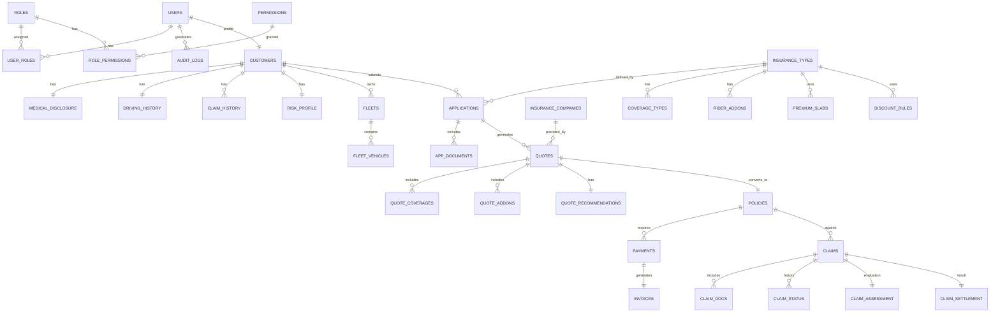
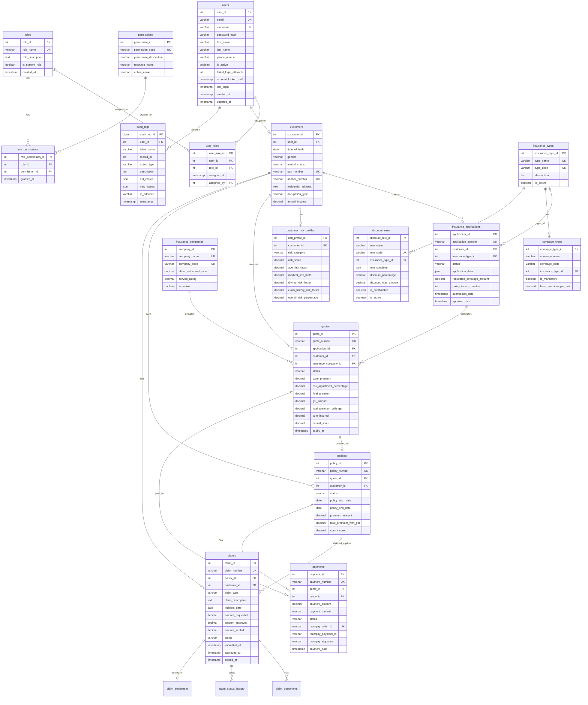
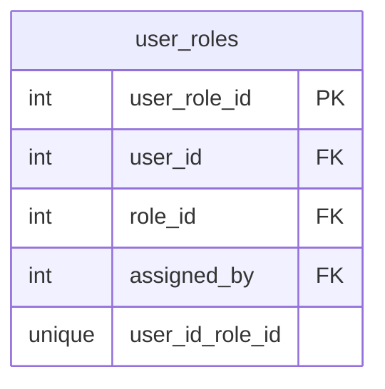
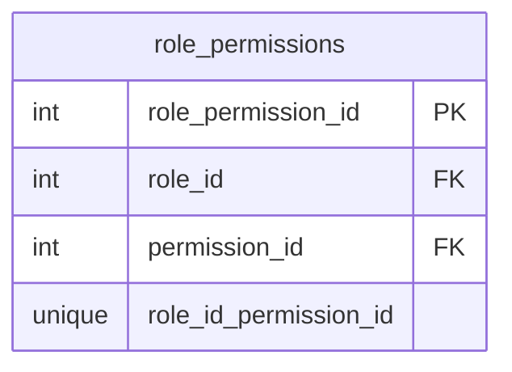
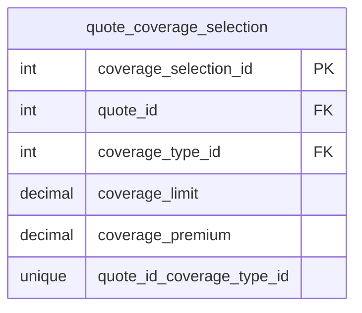

# Entity-Relationship Diagram

## Complete ER Diagram

The following diagram represents the complete database schema of the Insurance Policy Management System.

---

## 1. High-Level Entity Relationship Overview
0.

---

## 2. Detailed ER Diagram (Mermaid Syntax)

---

## 3. Junction Tables (Many-to-Many Relationships)

### 3.1 user_roles
Links Users ↔ Roles (M:N)

### 3.2 role_permissions
Links Roles ↔ Permissions (M:N)

### 3.3 quote_coverage_selection
Links Quotes ↔ CoverageTypes (M:N)

---

## 4. Cardinality Summary

| Relationship | Type | Description |
|-------------|------|-------------|
| User → CustomerProfile | 1:1 | Each user has at most one customer profile |
| User → UserRoles | 1:M | Users can have multiple roles |
| Role → UserRoles | 1:M | Roles can be assigned to multiple users |
| Customer → Applications | 1:M | Customers can submit many applications |
| Application → Quotes | 1:M | Applications generate multiple quotes |
| Quote → Policy | 1:1 | One accepted quote becomes one policy |
| Policy → Claims | 1:M | Policies can have multiple claims |
| Claim → Settlement | 1:1 | Each claim has one settlement record |
| InsuranceType → CoverageTypes | 1:M | Types have multiple coverage options |

---

## 5. Key Foreign Key Relationships

### Cascading Deletes
- `UserRoles` → CASCADE from User (user deletion removes roles)
- `InsuranceApplication` → CASCADE from Customer
- `Quote` → CASCADE from Application
- `ClaimDocument` → CASCADE from Claim

### Restrict Deletes
- `Policy` → RESTRICT from Quote (cannot delete quoted data)
- `Claim` → RESTRICT from Policy (cannot delete claimed policy)
- `CoverageType` → RESTRICT from InsuranceType

### Set Null
- `submitted_by`, `reviewed_by` → SET NULL (preserve records if user deleted)
