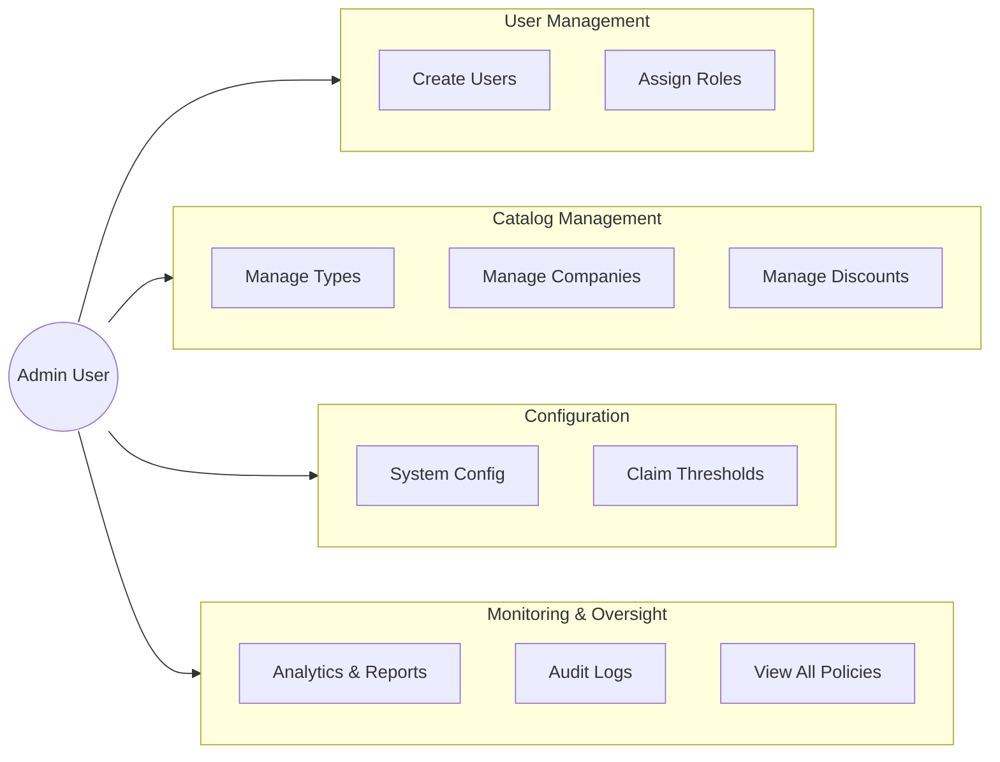

# Admin Use Cases

## Administrator Role Overview

The Admin role has full system access and is responsible for system configuration, user management, and operational oversight.

---

## Use Case Diagram



---

## Detailed Use Cases

### UC-A01: Manage Users

**Actor:** Admin  
**Precondition:** Admin is logged in  
**Description:** Admin can create, view, update, and deactivate user accounts

**Main Flow:**
1. Admin navigates to /panel/users/
2. System displays list of all users with roles
3. Admin can:
   - Create new user with form
   - Edit existing user details
   - Assign/revoke roles
   - Deactivate accounts

**Business Rules:**
- Cannot delete users with historical transactions
- System roles cannot be removed from system accounts

---

### UC-A02: Manage Insurance Types

**Actor:** Admin  
**Precondition:** Admin is logged in  
**Description:** Admin manages the insurance product catalog

**Main Flow:**
1. Admin navigates to /panel/catalog/insurance-types/
2. System displays all insurance types
3. Admin can:
   - Add new insurance type (name, code, description)
   - Edit existing type details
   - Activate/deactivate types

**Post-condition:** New insurance types are available for applications

---

### UC-A03: Manage Insurance Companies

**Actor:** Admin  
**Precondition:** Admin is logged in  
**Description:** Admin manages insurance company partners

**Main Flow:**
1. Admin navigates to /panel/catalog/companies/
2. System displays all insurance companies
3. Admin can:
   - Add new company (name, code, contact info)
   - Set claim settlement ratio
   - Set service rating
   - Activate/deactivate companies

**Business Rules:**
- Claim settlement ratio must be between 0 and 1
- Service rating must be between 0 and 5

---

### UC-A04: Configure System Settings

**Actor:** Admin  
**Precondition:** Admin is logged in  
**Description:** Admin configures system-wide settings

**Configurable Settings:**
| Key | Description | Default |
|-----|-------------|---------|
| GST_RATE | Tax percentage | 18 |
| QUOTE_VALIDITY_DAYS | Quote expiry | 30 |
| CLAIM_SLA_DAYS | Claim processing SLA | 15 |
| ACCOUNT_LOCK_THRESHOLD | Failed logins before lock | 5 |

**Main Flow:**
1. Admin navigates to /panel/configuration/
2. System displays all configurations
3. Admin updates values
4. System validates and saves changes

---

### UC-A05: Manage Discount Rules

**Actor:** Admin  
**Precondition:** Admin is logged in  
**Description:** Admin creates and manages discount rules

**Main Flow:**
1. Admin navigates to /panel/catalog/discounts/
2. System displays existing discount rules
3. Admin can:
   - Create new discount rule
   - Set conditions (JSON format)
   - Set discount percentage and max amount
   - Configure validity dates
   - Mark as combinable/exclusive

**Example Rule:**
```json
{
  "rule_name": "Fleet Discount",
  "rule_condition": {"min_fleet_size": 5},
  "discount_percentage": 10,
  "discount_max_amount": 50000,
  "is_combinable": true
}
```

---

### UC-A06: View Analytics Dashboard

**Actor:** Admin  
**Precondition:** Admin is logged in  
**Description:** Admin views business performance metrics

**Dashboard Metrics:**
- Total policies issued
- Total premium collected
- Claims submitted vs approved
- Conversion rate (quotes → policies)
- Revenue by insurance type
- Top insurance companies

**Main Flow:**
1. Admin navigates to /panel/dashboard/
2. System calculates and displays metrics
3. Admin can filter by date range

---

### UC-A07: View Audit Logs

**Actor:** Admin  
**Precondition:** Admin is logged in  
**Description:** Admin reviews system audit trail

**Main Flow:**
1. Admin navigates to /panel/audit-logs/
2. System displays audit entries
3. Admin can filter by:
   - User
   - Action type
   - Table name
   - Date range

**Logged Actions:**
- INSERT, UPDATE, DELETE
- LOGIN, LOGOUT
- STATUS_CHANGE
- APPROVE, REJECT

---

### UC-A08: Manage Coverage Types

**Actor:** Admin  
**Precondition:** Admin is logged in  
**Description:** Admin manages coverage options for insurance types

**Main Flow:**
1. Admin selects an insurance type
2. System displays coverage types for that type
3. Admin can:
   - Add coverage (name, code, base premium)
   - Mark as mandatory/optional
   - Set premium per unit

---

### UC-A09: Configure Claim Thresholds

**Actor:** Admin  
**Precondition:** Admin is logged in  
**Description:** Admin sets claim approval authority levels

**Main Flow:**
1. Admin navigates to /panel/catalog/claim-thresholds/
2. System displays existing thresholds
3. Admin configures:
   - Amount range (min, max)
   - Required approver role
   - SLA days for processing

**Example Configuration:**
| Range | Approver Role | SLA |
|-------|---------------|-----|
| ₹0 - ₹50,000 | BACKOFFICE | 7 days |
| ₹50,001 - ₹500,000 | BACKOFFICE | 15 days |
| ₹500,001+ | ADMIN | 30 days |

---

## Admin Access Matrix

| Resource | Create | Read | Update | Delete |
|----------|--------|------|--------|--------|
| Users | ✅ | ✅ | ✅ | ❌ (deactivate) |
| Roles | ✅ | ✅ | ✅ | ❌ (system roles) |
| Insurance Types | ✅ | ✅ | ✅ | ❌ |
| Insurance Companies | ✅ | ✅ | ✅ | ❌ |
| Coverage Types | ✅ | ✅ | ✅ | ❌ |
| Discount Rules | ✅ | ✅ | ✅ | ✅ |
| Configurations | - | ✅ | ✅ | - |
| Analytics | - | ✅ | - | - |
| Audit Logs | - | ✅ | - | - |
| All Applications | - | ✅ | ✅ | - |
| All Quotes | - | ✅ | ✅ | - |
| All Policies | - | ✅ | - | - |
| All Claims | - | ✅ | ✅ | - |
