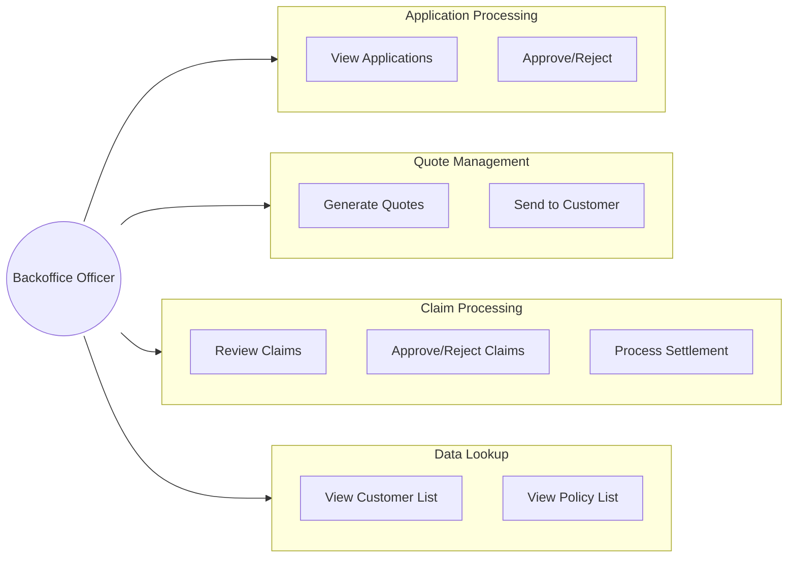
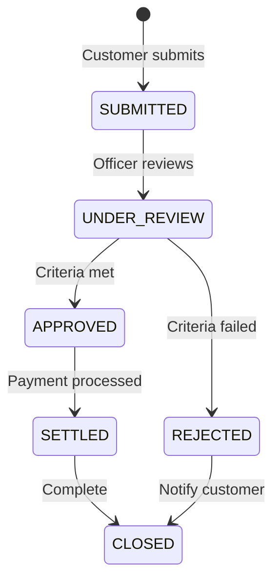

# Backoffice Use Cases

## Backoffice Officer Role Overview

Backoffice officers handle day-to-day operations including application review, quote generation, and claim processing.

---

## Use Case Diagram

---

## Detailed Use Cases

### UC-B01: Review Insurance Application

**Actor:** Backoffice Officer  
**Precondition:** Application is in SUBMITTED status  
**Description:** Officer reviews submitted applications and makes approval decisions

**Main Flow:**
1. Officer navigates to /backoffice/applications/
2. System displays applications with status filters
3. Officer selects application to review
4. System displays:
   - Customer profile
   - Application data
   - Uploaded documents
   - Insurance type details
5. Officer verifies documents
6. Officer approves or rejects application

**Alternative Flow - Reject:**
1. Officer enters rejection reason
2. System updates status to REJECTED
3. System sends notification to customer

**Post-condition:** Application status updated, notification sent

---

### UC-B02: Generate Quote for Application

**Actor:** Backoffice Officer  
**Precondition:** Application is APPROVED  
**Description:** Officer generates insurance quotes for approved applications

**Main Flow:**
1. Officer navigates to application detail
2. Officer clicks "Generate Quote"
3. System opens quote generation form
4. Officer selects:
   - Insurance company
   - Coverage types
   - Add-ons/riders
5. System calculates:
   - Base premium (from slabs)
   - Risk adjustment (from customer profile)
   - Applicable discounts
   - GST
   - Total premium
6. System generates quote with scoring
7. Quote is saved with GENERATED status

**Business Rules:**
- Quote validity: 30 days (configurable)
- Scoring algorithm applied automatically
- Multiple quotes can be generated per application

---

### UC-B03: Send Quote to Customer

**Actor:** Backoffice Officer  
**Precondition:** Quote is in GENERATED status  
**Description:** Officer sends quote to customer for review

**Main Flow:**
1. Officer views quote detail
2. Officer clicks "Send to Customer"
3. System updates quote status to SENT
4. System sends email notification with quote details
5. System creates in-app notification for customer

**Post-condition:** Customer receives quote via email and in-app notification

---

### UC-B04: Review Claim

**Actor:** Backoffice Officer  
**Precondition:** Claim is in SUBMITTED status  
**Description:** Officer reviews submitted claims

**Main Flow:**
1. Officer navigates to /backoffice/claims/
2. System displays claims with status filters
3. Officer selects claim to review
4. System displays:
   - Claim details
   - Policy information
   - Uploaded documents
   - Previous claims history
5. Officer starts review (status → UNDER_REVIEW)

**Business Rules:**
- SLA tracking begins on submission
- All document types verified

---

### UC-B05: Approve Claim

**Actor:** Backoffice Officer  
**Precondition:** Claim is UNDER_REVIEW, officer has approval authority  
**Description:** Officer approves claim within their authority limit

**Main Flow:**
1. Officer reviews claim details
2. Officer verifies claim is within their approval threshold
3. Officer enters approved amount (≤ requested amount)
4. System validates approval authority
5. System updates claim to APPROVED
6. System records status history
7. System sends notification to customer

**Business Rules:**
- Approved amount ≤ Requested amount
- Officer's role must match threshold's required_approver_role
- Claims above officer's limit require escalation

---

### UC-B06: Reject Claim

**Actor:** Backoffice Officer  
**Precondition:** Claim is UNDER_REVIEW  
**Description:** Officer rejects claim with reason

**Main Flow:**
1. Officer reviews claim details
2. Officer decides to reject
3. Officer enters mandatory rejection reason
4. System updates claim to REJECTED
5. System records status history
6. System sends notification to customer

**Mandatory Fields:**
- Rejection reason (cannot be empty)

---

### UC-B07: Process Claim Settlement

**Actor:** Backoffice Officer  
**Precondition:** Claim is APPROVED  
**Description:** Officer creates settlement for approved claim

**Main Flow:**
1. Officer navigates to approved claim
2. Officer clicks "Create Settlement"
3. System displays settlement form:
   - Settlement amount (pre-filled from approved amount)
   - Settlement method (Bank Transfer, Cheque)
   - Bank details (if applicable)
4. Officer enters/confirms details
5. System creates settlement record
6. Officer processes payment
7. System updates claim to SETTLED

**Settlement Methods:**
- BANK_TRANSFER: Requires account number, bank name, IFSC
- CHEQUE: Requires cheque number, date
- DIRECT_REPAIR: For vehicle insurance

---

### UC-B08: View Customer Profile

**Actor:** Backoffice Officer  
**Precondition:** None  
**Description:** Officer views customer details for reference

**Main Flow:**
1. Officer navigates to /backoffice/customers/
2. System displays customer list with search
3. Officer searches by name, email, or phone
4. Officer views customer detail:
   - Profile information
   - Applications history
   - Policies owned
   - Claims history
   - Risk profile

---

### UC-B09: View Policy Details

**Actor:** Backoffice Officer  
**Precondition:** None  
**Description:** Officer views policy information

**Main Flow:**
1. Officer navigates to /backoffice/policies/
2. System displays policies with filters
3. Officer can filter by:
   - Status (Active, Expired, Cancelled)
   - Insurance type
   - Customer
   - Date range
4. Officer views policy detail:
   - Policy information
   - Coverage details
   - Premium breakdown
   - Associated claims

---

## Backoffice Access Matrix

| Resource | Create | Read | Update | Delete |
|----------|--------|------|--------|--------|
| Users | ❌ | ❌ | ❌ | ❌ |
| Catalog | ❌ | ✅ | ❌ | ❌ |
| Customers | ❌ | ✅ | ❌ | ❌ |
| Applications | ❌ | ✅ | ✅ (status) | ❌ |
| Quotes | ✅ | ✅ | ✅ | ❌ |
| Policies | ❌ | ✅ | ❌ | ❌ |
| Claims | ❌ | ✅ | ✅ (within threshold) | ❌ |
| Settlements | ✅ | ✅ | ✅ | ❌ |
| Notifications | ❌ | ❌ | ❌ | ❌ |

---

## Claim Status Workflow (Backoffice Perspective)

