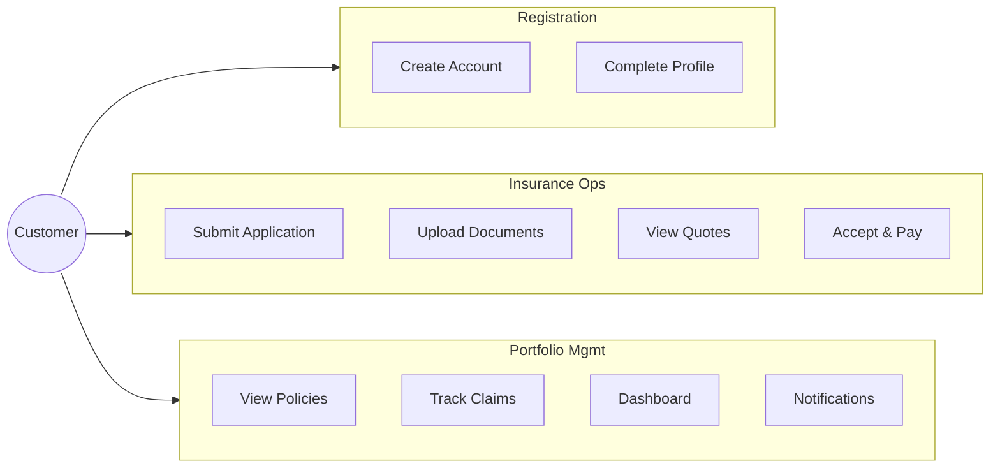
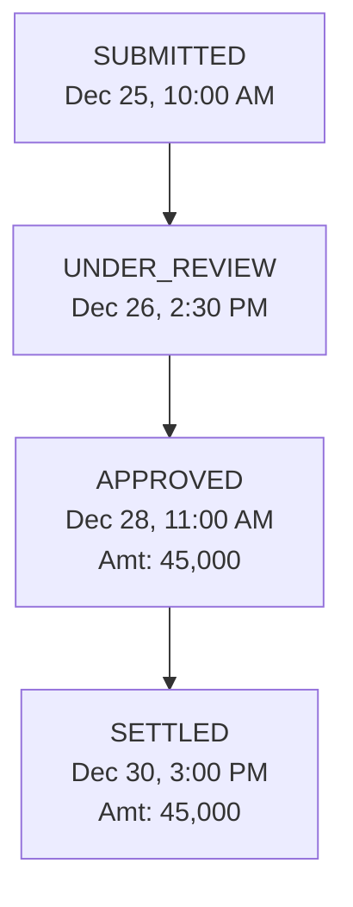
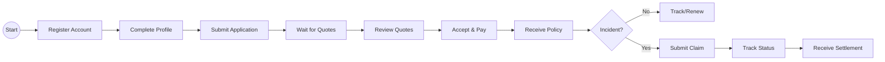

# Customer Use Cases

## Customer Role Overview

Customers are end-users who purchase insurance policies, submit claims, and manage their insurance portfolio.

---

## Use Case Diagram



---

## Detailed Use Cases

### UC-C01: Register Account

**Actor:** Prospective Customer  
**Precondition:** None  
**Description:** User creates a new customer account

**Main Flow:**
1. User navigates to /auth/register/
2. System displays registration form
3. User enters:
   - Email (unique)
   - Username
   - Password (confirmed)
   - First name, Last name
   - Phone number
4. System validates uniqueness of email/username
5. System creates user with CUSTOMER role
6. System creates CustomerProfile
7. User is redirected to profile completion

**Validation Rules:**
- Email: valid format, unique
- Password: minimum 8 characters
- Username: alphanumeric, unique

---

### UC-C02: Complete Profile

**Actor:** Customer  
**Precondition:** Customer is logged in  
**Description:** Customer completes their profile with required details

**Main Flow:**
1. Customer navigates to /customer/profile/
2. System displays profile form
3. Customer enters:
   - Date of birth
   - Gender
   - Marital status
   - Address details
   - PAN number (for insurance)
   - Occupation type
   - Annual income
4. System validates and saves profile

**Why This Matters:**
- Risk assessment requires age, occupation, income
- Premium calculation uses customer profile
- KYC compliance requires identity documents

---

### UC-C03: Submit Insurance Application

**Actor:** Customer  
**Precondition:** Customer has completed profile  
**Description:** Customer applies for insurance

**Main Flow:**
1. Customer navigates to /customer/applications/new/
2. System displays insurance type selection
3. Customer selects insurance type (Motor, Health, etc.)
4. System displays dynamic form based on type
5. Customer enters application details:
   - Coverage requirements
   - Budget range (min/max)
   - Type-specific data (vehicle details, health info)
6. Customer uploads required documents
7. Customer submits application
8. System creates application with SUBMITTED status
9. System sends confirmation notification

**Dynamic Form Data (Motor Insurance Example):**
```json
{
  "vehicle_make": "Honda",
  "vehicle_model": "City",
  "vehicle_year": 2022,
  "registration_number": "GJ01XX1234",
  "previous_policy_number": "POL-12345"
}
```

---

### UC-C04: View Quotes

**Actor:** Customer  
**Precondition:** Application is approved, quotes generated  
**Description:** Customer reviews generated quotes

**Main Flow:**
1. Customer navigates to /customer/quotes/
2. System displays quotes for their applications
3. Customer selects quote to view details
4. System displays:
   - Insurance company details
   - Premium breakdown
   - Coverage types included
   - Add-ons included
   - Overall score
   - Recommendation reason
5. Customer compares multiple quotes

**Quote Information Displayed:**
- Base premium
- Risk adjustment
- Discounts applied
- GST
- Total premium
- Validity period
- Suitability score (0-100)

---

### UC-C05: Accept Quote and Pay

**Actor:** Customer  
**Precondition:** Quote is in SENT status, not expired  
**Description:** Customer accepts quote and makes payment

**Main Flow:**
1. Customer views quote detail
2. Customer clicks "Accept & Pay"
3. System validates quote is not expired
4. System redirects to Razorpay checkout
5. Customer completes payment via:
   - Credit/Debit Card
   - Net Banking
   - UPI
   - Wallet
6. Razorpay sends success callback
7. System verifies signature (HMAC-SHA256)
8. System creates Policy record
9. System sends policy issuance notification

**Error Handling:**
- Payment failure: Show retry option
- Signature mismatch: Log security alert, reject payment
- Quote expired: Show error, suggest new quote

---

### UC-C06: View My Policies

**Actor:** Customer  
**Precondition:** Customer is logged in  
**Description:** Customer views their insurance policies

**Main Flow:**
1. Customer navigates to /customer/policies/
2. System displays customer's policies
3. Customer can filter by status:
   - Active
   - Expired
   - Cancelled
4. Customer views policy detail:
   - Policy number
   - Coverage details
   - Premium paid
   - Valid dates
   - Associated claims

---

### UC-C07: Submit Claim

**Actor:** Customer  
**Precondition:** Customer has active policy  
**Description:** Customer submits insurance claim

**Main Flow:**
1. Customer navigates to /customer/claims/new/
2. System displays claim form
3. Customer selects policy to claim against
4. Customer enters:
   - Claim type (Accident, Theft, Medical, etc.)
   - Incident date
   - Incident location
   - Description
   - Amount requested
5. Customer uploads supporting documents:
   - FIR copy (if applicable)
   - Medical reports
   - Damage photos
   - Repair estimates
6. Customer submits claim
7. System creates claim with SUBMITTED status
8. System sends confirmation notification

**Validation:**
- Policy must be active
- Claim amount ≤ Sum insured
- Incident date within policy period

---

### UC-C08: Track Claim Status

**Actor:** Customer  
**Precondition:** Customer has submitted claim  
**Description:** Customer tracks claim progress

**Main Flow:**
1. Customer navigates to /customer/claims/
2. System displays customer's claims
3. Customer views claim detail
4. System shows:
   - Current status
   - Status history timeline
   - Approved amount (if approved)
   - Rejection reason (if rejected)
   - Expected settlement date

**Status Timeline Display:**


---

### UC-C09: View Notifications

**Actor:** Customer  
**Precondition:** Customer is logged in  
**Description:** Customer views and manages notifications

**Main Flow:**
1. Customer sees notification badge in header
2. Customer clicks notification icon
3. System displays notifications:
   - Unread count
   - Recent notifications
4. Customer clicks to view full list
5. Customer can:
   - Mark as read
   - View related entity (policy, claim, etc.)

**Notification Types:**
- POLICY_ISSUED
- POLICY_EXPIRING
- CLAIM_SUBMITTED
- CLAIM_APPROVED
- CLAIM_REJECTED
- QUOTE_GENERATED
- PAYMENT_SUCCESS

---

### UC-C10: View Dashboard

**Actor:** Customer  
**Precondition:** Customer is logged in  
**Description:** Customer views summary dashboard

**Main Flow:**
1. Customer navigates to /customer/dashboard/
2. System displays:
   - Active policies count
   - Pending claims count
   - New quotes awaiting action
   - Recent notifications
   - Policies expiring soon
   - Quick action buttons

---

## Customer Journey Flow



---

## Customer Access Matrix

| Resource | Create | Read | Update | Delete |
|----------|--------|------|--------|--------|
| Own Profile | - | ✅ | ✅ | ❌ |
| Own Applications | ✅ | ✅ | ✅ (draft only) | ❌ |
| Own Quotes | ❌ | ✅ | ✅ (accept) | ❌ |
| Own Policies | ❌ | ✅ | ❌ | ❌ |
| Own Claims | ✅ | ✅ | ❌ | ❌ |
| Own Notifications | ❌ | ✅ | ✅ (read status) | ❌ |
| Other Customers | ❌ | ❌ | ❌ | ❌ |
| System Config | ❌ | ❌ | ❌ | ❌ |
| Catalog (view only) | ❌ | ✅ | ❌ | ❌ |
