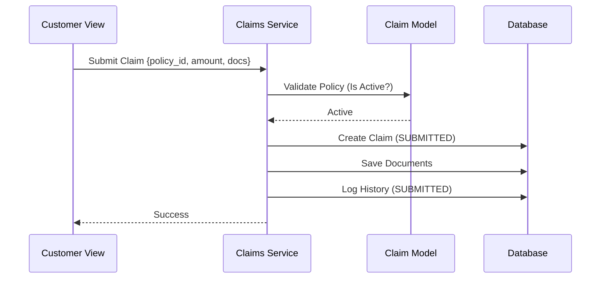
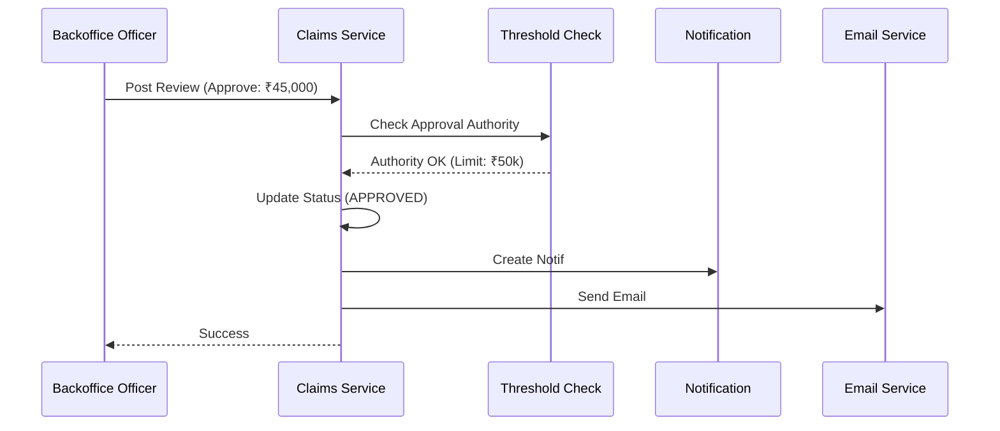
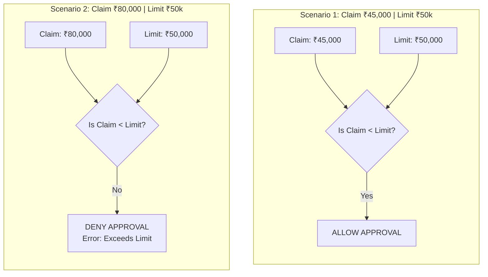
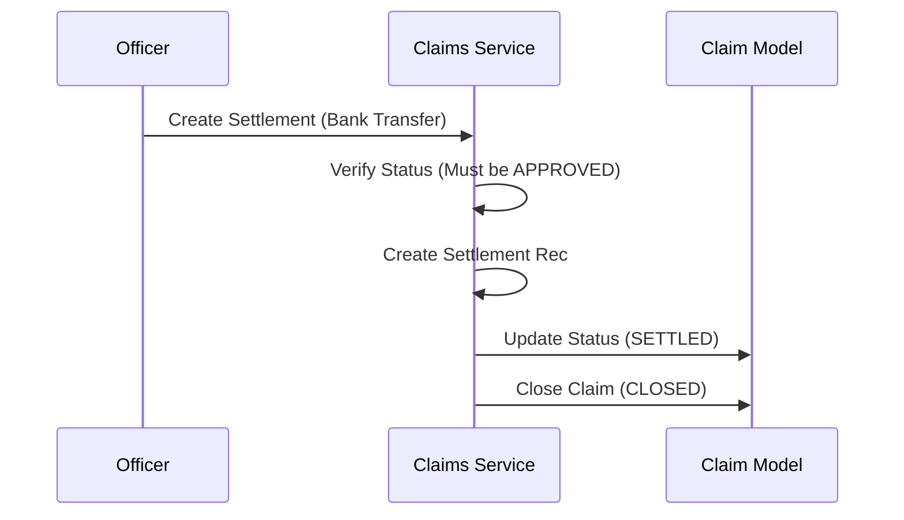

# Claims Lifecycle Sequence Diagram

## Overview

This document details the claims processing workflow, covering submission, review, approval, and settlement steps, emphasizing the state machine transitions and role-based thresholds.

---

## 1. Claim Submission Flow

---

## 2. Claim Review and Approval Flow

---

## 3. Threshold check logic (Detailed)

---

## 4. Settlement Process

---

## 5. State Machine Transitions

| Current State | Valid Next States | Trigger Action |
|---------------|-------------------|----------------|
| SUBMITTED | UNDER_REVIEW | start_review() |
| UNDER_REVIEW | APPROVED | approve() |
| UNDER_REVIEW | REJECTED | reject() |
| APPROVED | SETTLED | settle() |
| SETTLED | CLOSED | close() |
| REJECTED | CLOSED | close() |

**Invalid Transitions (Prevented by Logic):**
- SUBMITTED → APPROVED (Must review first)
- REJECTED → APPROVED (Final state)
- CLOSED → APPROVED (Final state)
