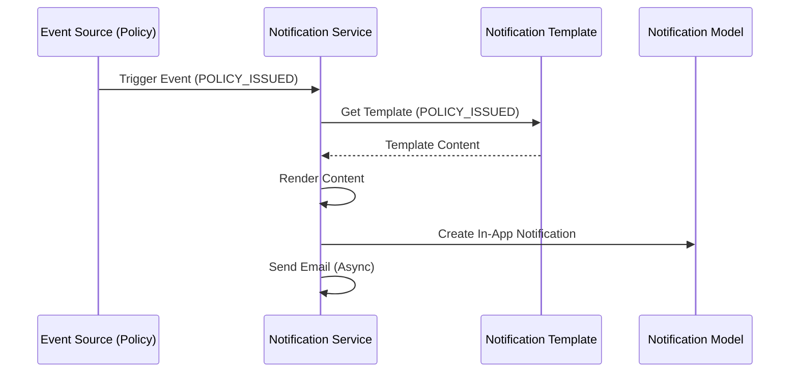
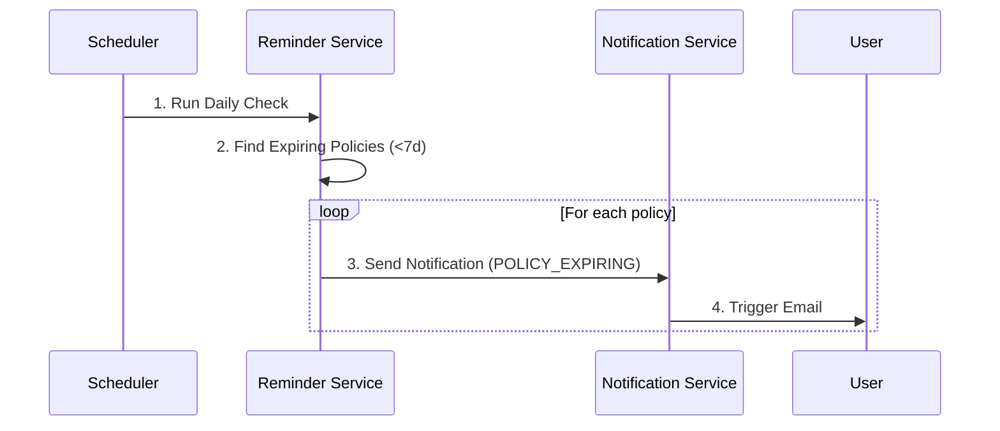
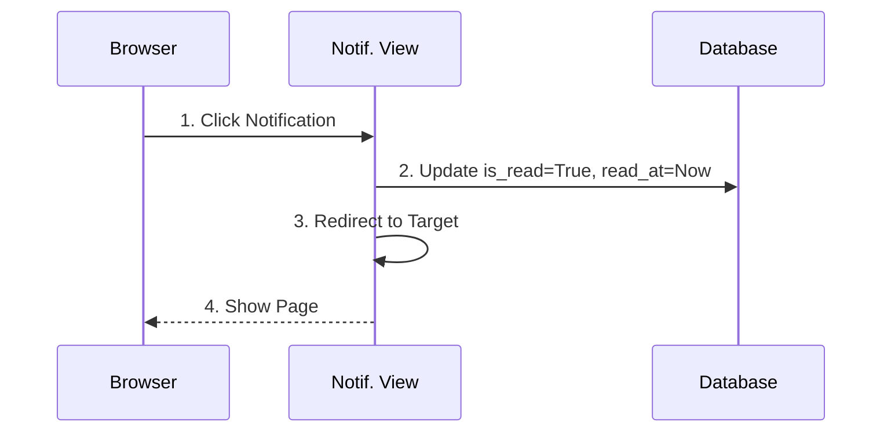

# Notification Flow Sequence Diagram

## Overview

This document describes how notifications are triggered by system events, processed, and delivered to users via multiple channels (In-App, Email).

---

## 1. Notification Trigger Flow



---

## 2. Scheduled Reminder Flow (Cron Job)



---

## 3. Notification Read Flow



---

## 4. Email Template Rendering

```python
# Conceptual Template Rendering
template_text = "Dear {name}, your policy {policy_number} is approved."
context = {
    "name": "John Doe",
    "policy_number": "POL-123"
}
# Result
"Dear John Doe, your policy POL-123 is approved."
```
