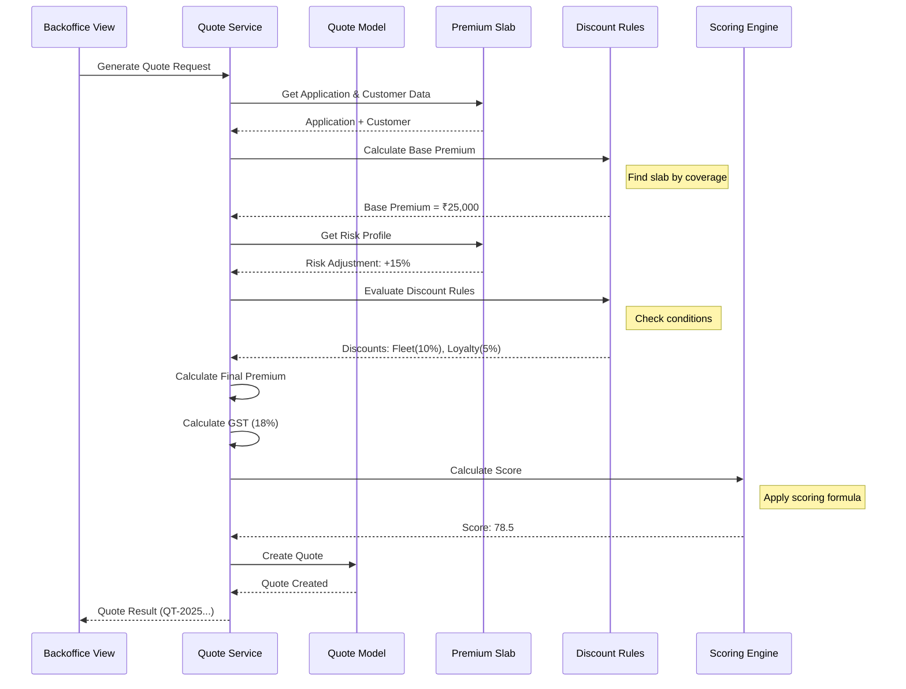
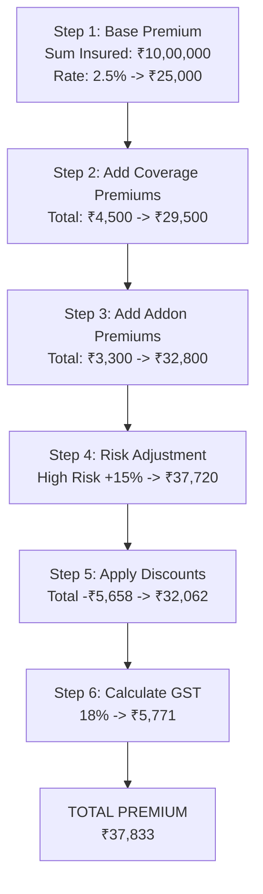
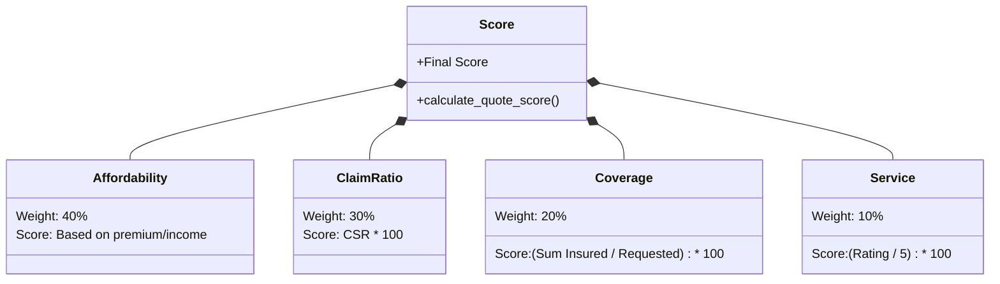
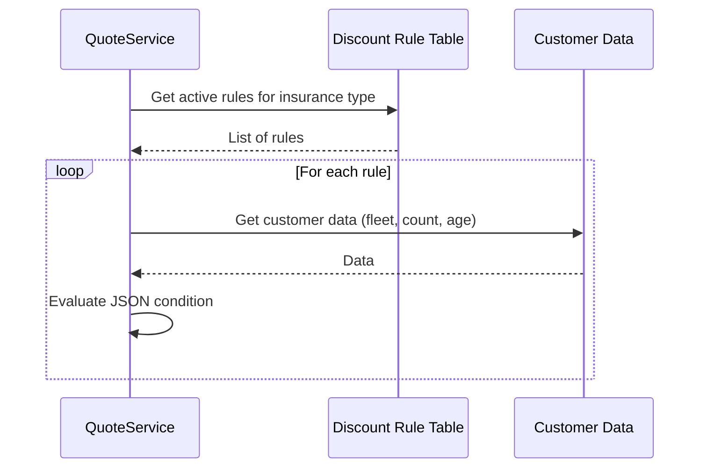

# Quote Generation and Scoring Sequence Diagram

## Overview

This document describes the quote generation workflow, premium calculation, and the rule-based scoring algorithm.

---

## 1. Quote Generation Flow



---

## 2. Premium Calculation Formula



---

## 3. Quote Scoring Algorithm

```python
# From apps/quotes/scoring.py

def calculate_quote_score(quote, customer, application):
    """
    Calculate overall quote suitability score.
    
    Formula:
    score = (0.4 × affordability) + (0.3 × claim_ratio) + 
            (0.2 × coverage_score) + (0.1 × service_rating)
    """
    
    # Component 1: Affordability (40% weight)
    # How affordable is the premium relative to customer income?
    affordability = calculate_affordability_score(
        premium=quote.total_premium_with_gst,
        annual_income=customer.annual_income
    )
    
    # Component 2: Claim Settlement Ratio (30% weight)
    # How reliable is the insurance company?
    claim_ratio = calculate_claim_ratio_score(
        company=quote.insurance_company
    )
    
    # Component 3: Coverage Completeness (20% weight)
    # Does the quote cover what was requested?
    coverage = calculate_coverage_score(
        quote=quote,
        application=application
    )
    
    # Component 4: Service Rating (10% weight)
    # Company's customer service quality
    service = calculate_service_rating_score(
        company=quote.insurance_company
    )
    
    # Weighted sum
    final_score = (
        (0.4 * affordability) +
        (0.3 * claim_ratio) +
        (0.2 * coverage) +
        (0.1 * service)
    )
    
    return round(final_score, 2)
```

### Scoring Components Detail



---

## 4. Example Score Calculation

> [!NOTE]
> **Example: Quote Score Calculation**
>
> **Customer**: Annual Income = ₹12,00,000
> **Quote**: Total Premium = ₹37,833, Sum Insured = ₹10,00,000
> **Company**: CSR = 0.92, Service Rating = 4.5/5
>
> | Component | Calculation | Score | Weighted |
> |-----------|-------------|-------|----------|
> | **Affordability** | 37,833 / 12,00,000 = 3.15% | 75 | 30 |
> | **Claim Ratio** | 0.92 × 100 | 92 | 27.6 |
> | **Coverage** | 10L / 10L = 1.0 | 100 | 20 |
> | **Service** | (4.5/5) × 100 | 90 | 9 |
> | **Total** | | | **86.6** |
>
> *Recommendation: "Highly Recommended - Excellent balance of affordability and coverage"*

---

## 5. Discount Rule Evaluation


