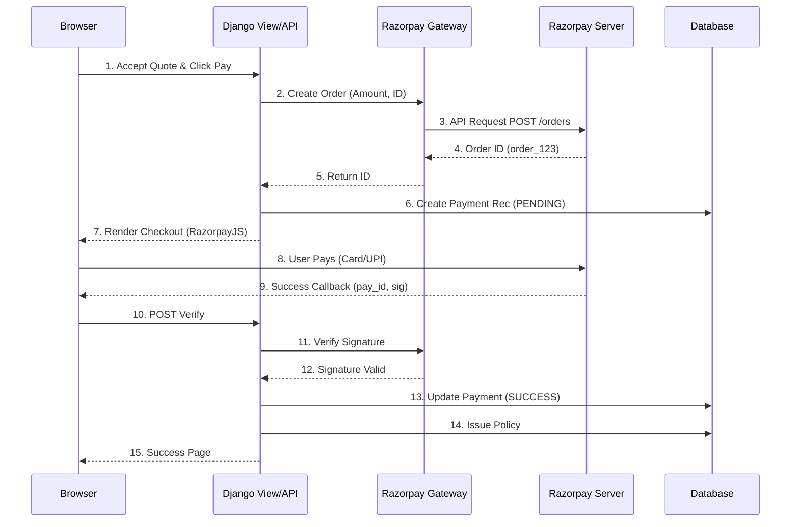
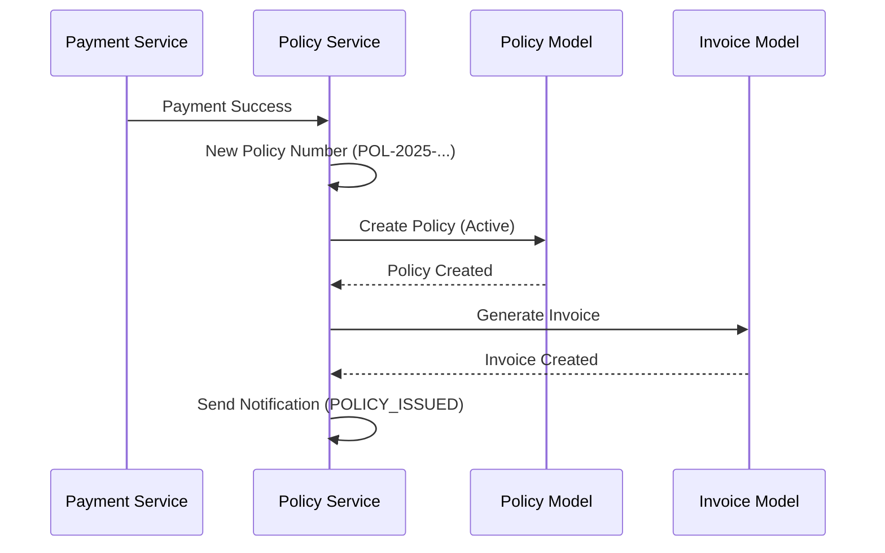

# Payment and Policy Issuance Sequence Diagram

## Overview

This document describes the payment integration with Razorpay (Sandbox) and the subsequent policy issuance process, highlighting the security measure of signature verification.

---

## 1. Razorpay Payment Flow



---

## 2. Signature Verification Logic (Security Critical)

Signature verification ensures that payment data hasn't been tampered with.

```python
# In apps/policies/payment_gateway.py

def verify_payment_signature(self, params_dict):
    """
    Verify Razorpay payment signature (HMAC-SHA256).
    
    Args:
        params_dict: {
            'razorpay_order_id': 'order_123',
            'razorpay_payment_id': 'pay_456',
            'razorpay_signature': 'bc9...3a'
        }
    """
    try:
        # 1. Construct the data string
        msg = f"{params_dict['razorpay_order_id']}|{params_dict['razorpay_payment_id']}"
        
        # 2. Get the secret key
        secret = settings.RAZORPAY_KEY_SECRET
        
        # 3. Generate expected signature (HMAC-SHA256)
        generated_signature = hmac.new(
            key=bytes(secret, 'utf-8'),
            msg=bytes(msg, 'utf-8'),
            digestmod=hashlib.sha256
        ).hexdigest()
        
        # 4. Compare strictly
        if generated_signature == params_dict['razorpay_signature']:
            return True
        else:
            raise SecurityError("Signature mismatch!")
            
    except Exception as e:
        return False
```

---

## 3. Policy Issuance Sequence



---

## 4. Failure Scenarios

### Scenario A: Payment Failed at Gateway
1. Razorpay returns failure callback
2. System updates Payment record to `FAILED`
3. Redirects user to failure page with retry option
4. No policy is issued

### Scenario B: Signature Mismatch (Tampering Attempt)
1. User manually edits response parameters
2. `verify_payment_signature` fails
3. System logs security alert in AuditLog
4. Payment remains `PENDING` (or marked suspect)
5. Policy is NOT issued

### Scenario C: Network Timeout after Deduction
1. Webhook (if configured) receives success event asynchronously
2. Backend processes webhook to update payment and issue policy
3. User receives email confirmation later

---

## 5. Invoice Generation Details

**Invoice Data Points:**
- **Invoice Number:** INV-20251231-001
- **Bill To:** Customer Name & Address
- **GSTIN:** Company GST Number
- **Line Items:**
  1. Base Premium ............. ₹25,000
  2. Add-ons .................. ₹ 3,300
  3. Less: Discounts ..........(₹ 5,658)
  4. Net Premium .............. ₹22,642
  5. CGST (9%) ................ ₹ 2,037
  6. SGST (9%) ................ ₹ 2,037
  7. **Total Payable** ........ **₹26,716**
