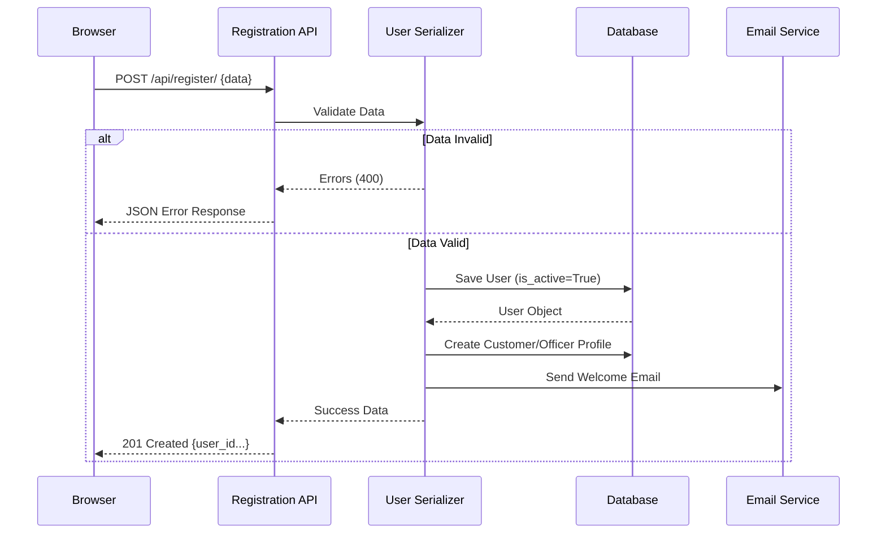
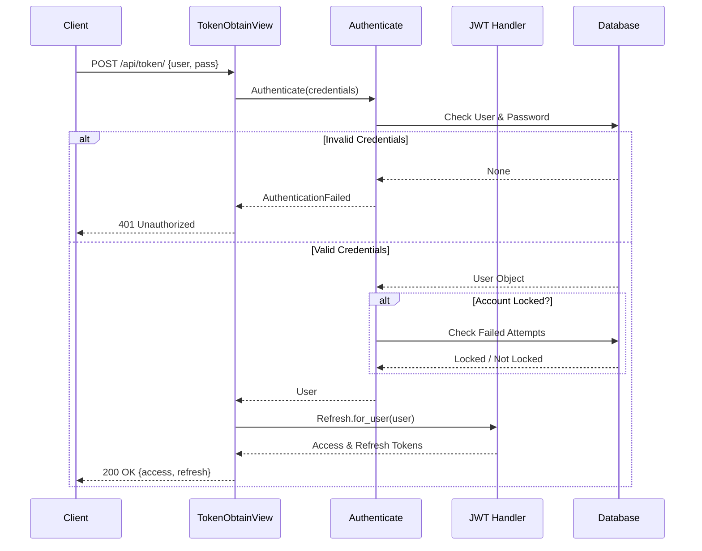
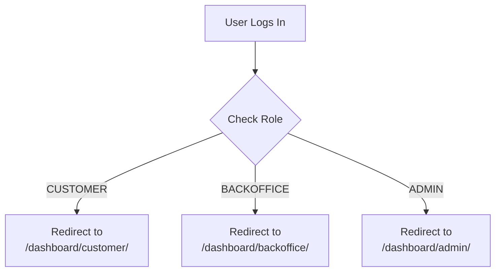
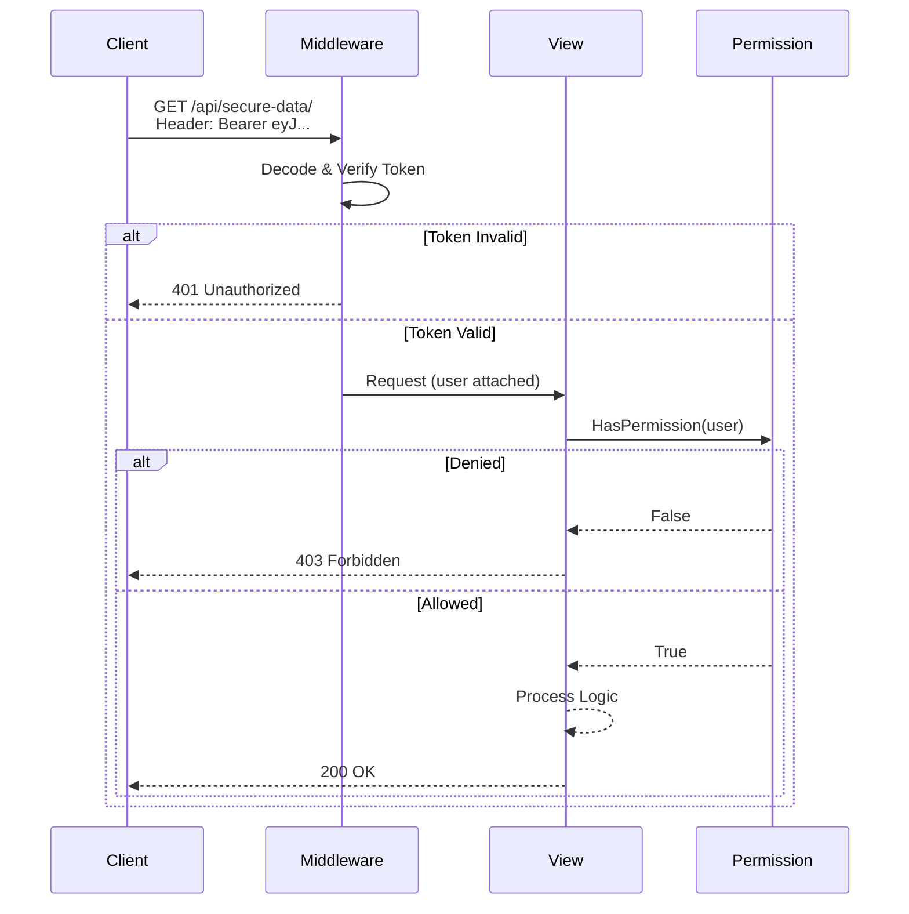
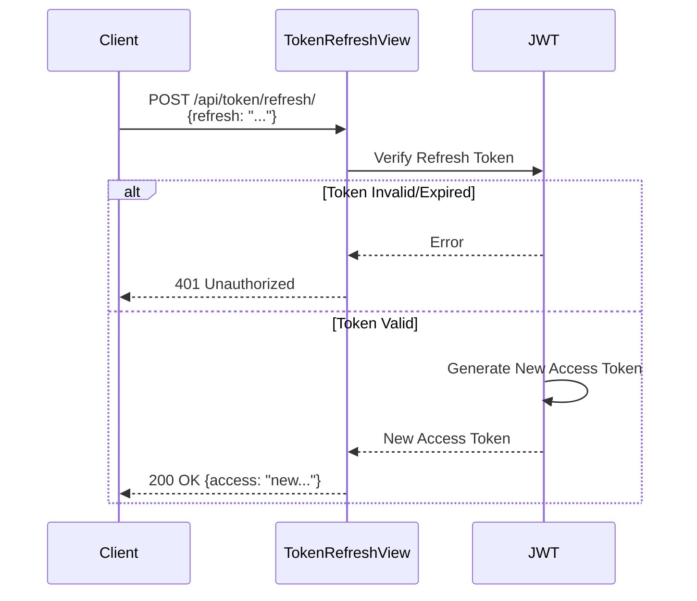
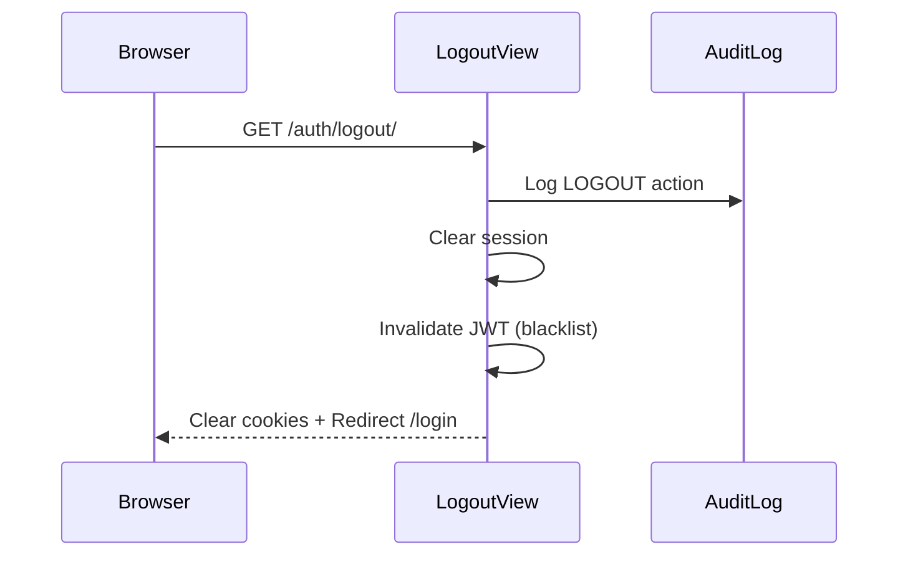

# User Registration and Login Sequence Diagram

## Overview

This document describes the authentication flow including user registration, login with JWT token generation, and account lockout mechanism.

---

## 1. User Registration Flow



### Registration Validation Rules

| Field | Validation | Error Message |
|-------|-----------|---------------|
| email | Unique, valid format | "Email already registered" |
| username | Unique, alphanumeric | "Username already taken" |
| password | Min 8 chars | "Password too short" |
| password_confirm | Must match password | "Passwords do not match" |

---

## 2. User Login Flow (JWT)



### JWT Token Structure

```json
{
  "access_token": {
    "token_type": "access",
    "exp": 1704067200,  // 30 minutes from now
    "user_id": 123,
    "email": "customer@example.com"
  },
  "refresh_token": {
    "token_type": "refresh",
    "exp": 1704672000,  // 7 days from now
    "user_id": 123
  }
}
```

---

## 3. Failed Login and Account Lockout

```
┌────────────┐     ┌────────────┐     ┌────────────┐     ┌────────────┐
│   Browser  │     │  AuthView  │     │   User     │     │  Config    │
│            │     │            │     │   Model    │     │            │
└─────┬──────┘     └─────┬──────┘     └─────┬──────┘     └─────┬──────┘
      │                  │                  │                  │
      │ POST {email,     │                  │                  │
      │   wrong_password}│                  │                  │
      ├─────────────────►│                  │                  │
      │                  │                  │                  │
      │                  │ check_password() │                  │
      │                  ├─────────────────►│                  │
      │                  │                  │                  │
      │                  │ False            │                  │
      │                  │◄─────────────────┤                  │
      │                  │                  │                  │
      │                  │ record_failed_   │                  │
      │                  │ login()          │                  │
      │                  ├─────────────────►│                  │
      │                  │                  │                  │
      │                  │                  │ failed_attempts++│
      │                  │                  ├─────────┐        │
      │                  │                  │◄────────┘        │
      │                  │                  │                  │
      │                  │                  │ Get threshold    │
      │                  │                  ├─────────────────►│
      │                  │                  │                  │
      │                  │                  │ LOCK_THRESHOLD=5 │
      │                  │                  │◄─────────────────┤
      │                  │                  │                  │
      │                  │                  │ [If attempts ≥ 5]│
      │                  │                  │ lock_account()   │
      │                  │                  ├─────────┐        │
      │                  │                  │◄────────┘        │
      │                  │                  │                  │
      │                  │ Updated count    │                  │
      │                  │◄─────────────────┤                  │
      │                  │                  │                  │
      │ Error: Invalid   │                  │                  │
      │ credentials      │                  │                  │
      │ (4 attempts left)│                  │                  │
      │◄─────────────────┤                  │                  │
      │                  │                  │                  │
```

### Account Lockout Logic

```python
# In User model (apps/accounts/models.py)

def is_account_locked(self):
    """Check if account is currently locked."""
    if self.account_locked_until:
        if timezone.now() < self.account_locked_until:
            return True
        else:
            # Lock expired, reset
            self.account_locked_until = None
            self.failed_login_attempts = 0
            self.save()
    return False

def record_failed_login(self):
    """Record failed login attempt."""
    self.failed_login_attempts += 1
    threshold = BusinessConfiguration.get_int('ACCOUNT_LOCK_THRESHOLD', 5)
    
    if self.failed_login_attempts >= threshold:
        self.lock_account()
    self.save()

def lock_account(self, duration_minutes=30):
    """Lock the account for specified duration."""
    self.account_locked_until = timezone.now() + timedelta(minutes=duration_minutes)
    self.save()
```

---

## 4. Role-Based Redirect After Login



### Code Reference

```python
# In apps/accounts/mixins.py

def get_dashboard_url(user):
    """Get appropriate dashboard URL for user based on role."""
    if has_role(user, 'ADMIN'):
        return '/panel/dashboard/'
    elif has_role(user, 'BACKOFFICE'):
        return '/backoffice/dashboard/'
    elif has_role(user, 'CUSTOMER'):
        return '/customer/dashboard/'
    return '/auth/login/'
```

---

## 5. API Authentication Flow (JWT)



---

## 6. Token Refresh Flow



---

## 7. Logout Flow


